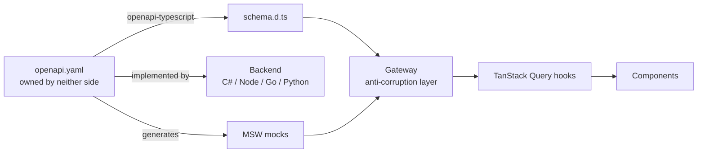
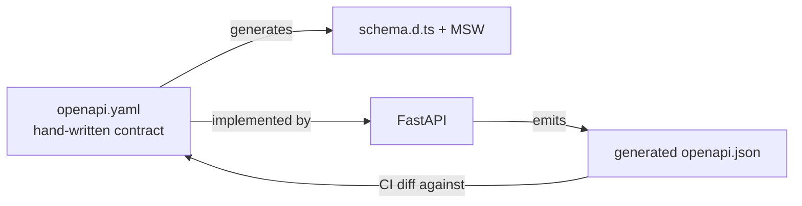

# Overview
---

**Goal:** A reusable UI foundation for personal projects that display and edit data from a database, built and maintained primarily by AI coding agents.

**Core constraint:** The developer is a back-end engineer who does not intend to learn front-end. Every decision below optimizes for *AI-authorability* over developer familiarity.

- **Stack:** Vite + React 19 + TypeScript + Tailwind v4 + shadcn/ui (Base UI primitives — see Decision Ledger)
- **Distribution:** GitHub repository (public as of Phase 10) used as a shadcn registry
- **Backend:** FastAPI + SQLModel + PostgreSQL — built after Phase 7, against a contract the UI has already proven
- **Plan date:** August 27, 2026 · **Revised:** September 15, 2026 (v1.2)

## Who Reads This Document

This file is agent-facing. It is loaded into the coding agent's context at the start of every session, so everything in it is written in units the agent can measure — files, tests, lint rules, exit checks — and never in units it cannot, such as human hours or weekends.

Human-only material (effort budgets, when to cut scope, how to respond when the agent misbehaves) lives in `docs/OPERATOR.md`, which is **not** given to the agent. Keeping the two apart matters: an agent that reads "this should take a weekend" has no way to convert that into anything except a guess, and it guesses in both directions — stopping early because the work "feels like enough for a weekend," or padding because it believes it has time to spare.

## Scope Ceiling

The failure mode for this project is not building the wrong thing. It is building forever.

- **Definition of done:** `scripts/check-phase-7.sh` passes. Not "the component library feels complete."
- **Scope budget (agent-measurable):** the demo domain has exactly the six field types in Phase 4 and no more; the foundation ships exactly three composites (`app-shell`, `data-table`, `entity-form`); the registry exposes exactly three items (`conventions`, `theme`, `starter`). Anything beyond these is out of scope for v1.0 and goes in `docs/DEFERRED.md`, not in code.
- **Explicit non-goal:** This foundation does not need to be good. It needs to be **reusable**. Polish is what the first real application is for.
- **Stop condition per phase:** the phase's check script passes and `docs/phases/phase-N.md` is written. Nothing else — not a sense of completeness, not remaining budget — ends or extends a phase.

## Decision Ledger

| Decision | Outcome | Rationale |
|---|---|---|
| Author vs. adopt | Adopt shadcn/ui | Open-code components live in-repo where an AI can read and edit them |
| Primitive library | Base UI (shadcn default since July 2026) | **Confirmed against the changelog.** Every shadcn component ships for both Radix and Base UI. Base UI is the default the CLI, docs and `llms.txt` now assume, so it is what the agent's tooling will describe. Radix has denser training data; if the agent repeatedly reaches for Radix APIs, `shadcn init -b radix` is a one-flag reversal at Phase 1 only. React Aria became a third base in July 2026 (`--base aria`) — not chosen, noted so the agent does not treat it as invalid |
| Framework | Vite SPA | Next.js server features duplicate the backend; RSC boundaries are a top AI error source |
| Router | React Router v7 | Densest training data |
| Distribution | GitHub registry | Pinned refs without the `node_modules` black box |
| Component browser | Kitchen-sink route | Storybook deferred until 3+ custom composites exist |
| Component browser (Phase 9) | Storybook, replacing kitchen-sink everywhere (dev route, registry `starter` item, permanent Phase 3/5 checks) | The Phase 1 deferral condition was met (3 composites shipped; visual regression already existed) — see docs/phases/phase-9.md for the full-replacement-vs-internal-only tradeoff |
| Theming | Two-layer tokens, installed in Phase 1 | Multi-theme is nearly free later if the discipline holds from day one — so the discipline must exist before the first screen, not after |
| Backend coupling | Contract-first OpenAPI + anti-corruption layer | Protocol is sealed; backend becomes one implementation of an owned contract |
| Backend | FastAPI + SQLModel | Least code per entity; best OpenAPI story. Chosen over C# to minimize generated surface rather than to maximize reviewability |
| Auth (Phase 10) | Single provider file; session cookies once the backend was chosen | Same-origin deployment (Phase 8's `StaticFiles` mount) makes cookies the simplest option — see "Auth Boundary" below |
| Verification | Automated gate, not inspection | The developer cannot review front-end code by reading it |
| Exit criteria | Executable check scripts | An exit criterion the agent can self-assess is one it can talk itself past. `scripts/check-phase-N.sh` is the only judge of done |
| Rule enforcement | Every hard rule has a mechanical enforcer | Agents route around instructions they don't see the point of. A rule that exists only in `AGENTS.md` is a wish |
| Linter | ESLint (not Biome) | The boundary rules below need `no-restricted-imports` with patterns and `no-restricted-syntax`; one linter, referenced consistently everywhere |
| Tool pinning | Exact versions, never `@latest` | This plan is executed across many fresh sessions over weeks. `npx shadcn@latest` means Phase 7 can run against a different CLI than Phase 1 |

## Assumptions

- Reference screens are built against a throwaway `Widgets` domain — no first real app exists yet.
- The foundation repo and its demo app live together. Consuming apps are separate repos.
- Both assumptions are cheap to reverse.

# Architecture
---

## Repository Topology

```plain text
ui-foundation/  (GitHub repo — this IS the registry)
├── registry.json           Registry manifest
├── AGENTS.md               Conventions every agent reads (Codex, Cursor, Copilot, Gemini…)
├── CLAUDE.md               One line: "@AGENTS.md" — Claude Code reads this
├── .claude/
│   ├── settings.json       Hooks: dependency allowlist, stop gate
│   ├── hooks/              The hook scripts
│   ├── agents/             spec-tester, phase-verifier (isolated-context subagents)
│   └── skills/
│       ├── new-entity/SKILL.md    The playbook as a versioned, invocable skill
│       └── phase/SKILL.md         "/phase N" — one phase, one session
├── .codex/
│   ├── hooks.json          Same hooks for Codex
│   └── skills/ → ../.claude/skills   (symlink; same SKILL.md standard)
├── docs/
│   ├── BUILD-PLAN.md       This file — agent-facing
│   ├── OPERATOR.md         Human-facing: effort budgets, scope cuts, intervention playbook
│   ├── DEFERRED.md         Where out-of-scope ideas go instead of into code
│   ├── add-an-entity.md    The most-repeated task, as a runbook
│   └── phases/             phase-N.md handoff reports, written at each phase end
├── scripts/
│   ├── check-phase-1.sh …  Executable exit criteria — the ONLY definition of done
│   ├── check-deps.mjs      package.json ⊆ allowlist
│   └── consume-test.sh     Phase 7 as a repeatable job (fresh app + registry install + verify)
├── openapi.yaml            Source of truth — owned by neither side
├── deps-allowlist.json     Every permitted dependency, by name
├── src/
│   ├── styles/theme.css    Two-layer design tokens (Phase 1)
│   ├── components/ui/      shadcn primitives (CLI-installed)
│   ├── components/app/     Your composites — app-shell, data-table, entity-form
│   ├── auth/               Isolated auth boundary
│   ├── api/
│   │   ├── transport/      ONLY place fetch appears
│   │   ├── gateway/        Anti-corruption layer
│   │   ├── contracts.ts    Page<T>, AppError, QuerySpec
│   │   └── schema.d.ts     Generated from openapi.yaml
│   ├── mocks/              MSW handlers — runs with no backend
│   └── routes/
│       ├── kitchen-sink.tsx
│       └── widgets/        Reference screens
├── tests/                  Gateway translation tests + mock-conformance tests
├── e2e/                    Playwright smoke + axe a11y + dark-mode screenshots
└── config/                 Shared tooling config (eslint, tsconfig fragments)
```

## Backend Decoupling

**Contract-first.** `openapi.yaml` is owned separately from any backend and is the published language between the two contexts. A new backend is not a migration — it is a second implementation of a contract that already exists.



- Swapping the backend replaces one implementation of an unchanged contract.
- MSW means the entire UI builds and runs with no backend at all.

### Anti-Corruption Layer

Entity shapes are not what break on a backend swap — a `Widget` has an id and a name in any language. **The protocol breaks.** ASP.NET Core returns `?page=2&pageSize=20` and RFC 7807; FastAPI returns `?offset=40&limit=20` and `{"detail":[...]}`; Go might return cursors.

Working principle: **seal the protocol, pass through the entities.**

| Coupling point | Risk | Strategy |
|---|---|---|
| Entity fields | 🟢 Low | Generated types, pass through |
| Pagination | 🚨 High | Normalize to `Page<T>` |
| Error format | 🚨 High | Normalize to `AppError` |
| Filter/sort syntax | 🚨 High | Own `QuerySpec`, serialize in transport |
| Auth | 🚨 High | Single provider file |
| Casing, dates, decimals | ⚠️ Medium | One interceptor |

These four UI-owned types carry most of the agnosticism. Backends translate *into* them, never the reverse.

```ts
type Page<T> = { items: T[]; total: number; page: number; pageSize: number }

type AppError = {
  kind: 'validation' | 'notfound' | 'auth' | 'server' | 'network'
  message: string
  fieldErrors?: Record<string, string[]>   // binds straight to RHF
}

type QuerySpec = {
  page: number
  pageSize: number
  sort?: { field: string; dir: 'asc' | 'desc' }
  filters?: Record<string, unknown>
}
```

**Deliberately excluded:** hand-written domain entities and mappers. Generated entity types crossing the boundary is acceptable coupling. Mappers are where this pattern collapses under its own maintenance weight.

> [!Warning]
> Agents route around indirection they do not see the point of. Enforce the boundary mechanically — a lint rule, not a line in `AGENTS.md`.

```js
// eslint no-restricted-imports
{ patterns: [{ group: ['**/transport/*'], message: 'Go through the gateway.' }] }
```

## Verification Strategy

Every other section of this plan optimizes for *generating* code. This one exists because nothing else detects when the generated code is wrong.

The constraint is specific: the developer cannot review front-end code by reading it. Exit criteria verified by looking at the screen catch layout problems and miss everything else — broken types, swallowed errors, accessibility, and regressions in screen three caused by an edit to screen one.

**Rule: if a check cannot run in CI, it does not count as verification.** This applies to exit criteria too — see *Exit Criteria Are Scripts* below.

Two tiers. The fast tier runs constantly (after every edit, and as the agent's stop gate); the full tier runs at phase boundaries, before commits, and in CI. Running Playwright after every file edit is how an agent spends its whole session waiting on a browser.

```bash
# npm run verify:fast — inner loop; the Stop hook runs this
npm run gen:api && git diff --exit-code -- src/api/schema.d.ts   # spec drift (scoped!)
tsc --noEmit                                                     # types
eslint . --max-warnings 0                                        # boundary + token + query rules
node scripts/check-deps.mjs                                      # dependency allowlist
vitest run                                                       # gateway translation + mock conformance

# npm run verify — verify:fast plus:
playwright test                                                  # smoke + axe a11y + dark-mode shots
```

| Check | Catches | Cost |
|---|---|---|
| `git diff` after codegen, **scoped to `schema.d.ts`** | Types edited by hand instead of regenerated. (Unscoped, this fails on any uncommitted work-in-progress and the agent learns to ignore the gate) | Free |
| `tsc --noEmit` | Contract drift, bad props | Free |
| ESLint boundary rule | Agent bypassing the gateway | Free |
| ESLint token rule | Raw hex / Tailwind palette classes — dark mode as a *lint error*, not a visual surprise | Free |
| `@tanstack/eslint-plugin-query` + `no-restricted-syntax` on `fetch` | Fetching in `useEffect`, bypassing Query | Free |
| Dependency allowlist | Agent installing MUI, Chakra, axios, moment… | Free |
| **Gateway tests** | Silent translation bugs in the ACL | ~20 tests, once |
| **Mock-conformance tests** | MSW handlers drifting from `openapi.yaml` — mocks that lie make every screen test meaningless | ~1 test per operation |
| **Playwright smoke** | Regressions in screens you are not looking at | One spec per screen |
| **`@axe-core/playwright`** | Accessibility damage in composites | 1 line |
| **Dark-mode screenshots** | Hardcoded colors the lint rule cannot see (inline styles, SVG fills) | One spec, `toHaveScreenshot` per kitchen-sink section |

- **Gateway tests are the priority.** The ACL is the one place a subtle bug is both invisible and expensive. Assert that a 422 becomes `AppError.kind = 'validation'` with populated `fieldErrors`, that pagination normalizes correctly, and that a network failure never surfaces as a success.
- **Mock-conformance tests keep the mocks honest.** Load `openapi.yaml`, call each MSW handler, validate the response body against the operation's response schema (ajv or `openapi-response-validator`). Without this, MSW is a second, unversioned contract.
- **Accessibility will not be caught by eye.** It is free at the shadcn primitive level and easy to destroy in composites.

> [!Warning]
> Have the agent write tests **from `openapi.yaml`**, not from the implementation. Tests derived from code the agent just wrote only prove it was self-consistent. Do not enforce this by asking — enforce it by **context isolation**: gateway tests are written by a subagent (`.claude/agents/spec-tester.md`) whose context contains `openapi.yaml` and `contracts.ts` and which is denied read access to `src/api/gateway/`. The deny hook goes in the agent file's frontmatter, not in `settings.json` — see *Subagents* under Harness Integration. Order helps too: in Phase 2 the tests are written *before* the gateway exists.

## Exit Criteria Are Scripts

Every phase ends with `scripts/check-phase-N.sh`. The script is the exit criterion; the prose under each phase is documentation of what the script checks. The agent does not decide it is done — the script does. This is what makes the plan runnable unattended, and it is also what prevents the two symmetric failures of self-assessed completion: stopping early because the work feels sufficient, and continuing because there is no signal to stop.

Rules for check scripts:

- Each script runs `npm run verify` (full tier) and then asserts the phase-specific facts (files exist, routes respond, registry validates). Exit non-zero on any failure with a one-line reason on stderr.
- Scripts are cumulative: `check-phase-4.sh` calls `check-phase-3.sh` first. Later phases cannot silently break earlier ones.
- Visual criteria are converted, never kept: "dark mode looks right" becomes a lint rule plus a screenshot comparison; "navigable shell" becomes a Playwright test that visits every nav entry.
- The one criterion that cannot be scripted — "a competent agent could clone these screens without asking questions" — is scripted by making a different agent do it (`scripts/consume-test.sh`, Phase 7).

## Backend Profile — FastAPI

The backend is built **after Phase 7**, against a contract the UI has already validated. Nothing below blocks Phases 1-7.

### Contract Direction

FastAPI generates OpenAPI from code; this plan is contract-first. The resolution is to keep `openapi.yaml` as the source of truth and treat FastAPI's generated spec as a **conformance test**, not a replacement.



- Letting FastAPI own the spec would require the backend to exist before Phase 2. That reintroduces the blocker this plan removed.
- Consider Schemathesis for property-based conformance testing against the spec.

### Stack

| Concern | Choice |
|---|---|
| Framework | FastAPI |
| ORM + validation | SQLModel — drop to raw SQLAlchemy 2.0 for complex queries |
| Migrations | Alembic — SQLModel does not include them |
| Driver | asyncpg |
| Type checking | mypy or pyright — **mandatory**, this is what replaces the compiler |

### Contract Conformance

You own both sides, and `openapi.yaml` already specifies `Page<T>` and the error shape. A backend that emits those is conforming to the contract, not being contorted to fit the UI — so translation belongs server-side wherever it can go, where it costs a few lines instead of a mapping layer.

| Concern | Where | How |
|---|---|---|
| Casing | **Backend** | Pydantic `alias_generator=to_camel` + `populate_by_name` — Python stays `snake_case` internally, JSON is `camelCase` |
| Pagination | **Backend** | Return `Page[T]` directly; the contract already defines it |
| Validation errors | **Backend** | Custom `RequestValidationError` handler emits `AppError` with `fieldErrors` |
| Dates, decimals | **Backend** | Pydantic serializers |
| `QuerySpec` → query string | **Gateway** | Client-side by nature |
| Network / timeout failures | **Gateway** | Never reach the server; must originate client-side |
| Deployment | Both | `app.mount("/", StaticFiles(directory="dist", html=True))` gives one deployable and same-origin |

The gateway gets thinner, not deleted. It remains the seam gateway tests attach to, the origin of network-failure mapping, the adapter for any third-party API that will not conform, and the enforcement point for the transport lint rule.

> [!Note]
> The `StaticFiles` mount preserves the single-deployable, same-origin, cookie-auth setup. The auth decision stays as simple as it would have been in .NET.

> [!Warning]
> SQLModel's headline feature — one class as both table and API schema — is also its main hazard. Returning table models directly leaks database columns into responses. Define separate response models whenever the shapes differ.

## Auth Boundary

Auth is the most backend-coupled part of any front-end. Isolate it to one file so the decision stays deferred.

```plain text
src/auth/
├── auth-provider.tsx   The ONLY file that knows how auth works
└── use-auth.ts         Everything else consumes this
```

| Approach | Backend-agnostic | Notes |
|---|---|---|
| Session cookies | Only if same-origin | Simplest when the SPA is served by the API |
| JWT in memory + refresh | Yes | Portable, more moving parts |
| Managed (Clerk, Supabase, Auth0) | Yes | Backend only validates a token; least work |

**Recommendation:** Stub `useAuth()` with a hardcoded user in Phase 3. Choose a real mechanism when the backend is chosen.

**Resolved in Phase 10** (docs/phases/phase-10.md): session cookies, chosen for exactly the reason the table above predicts — the app is same-origin (Phase 8's `StaticFiles` mount), so cookies are simplest and need no token-storage strategy. Implemented stdlib-only (PBKDF2 password hashing, `secrets`-generated session tokens, a server-side sessions table) — zero new dependency, on either side. Login only, against a seeded user; no self-service registration (see docs/DEFERRED.md). `auth-provider.tsx` still is the one file that knows any of this — it now calls `/auth/me`/`/auth/login`/`/auth/logout` through `src/api/gateway/auth.ts` via TanStack Query, the same as every other resource.

# Build Phases
---

## Phase 0 — Session Zero (human, then agent)

Done once, by the human, before any agent session. Details in *Quick Start*.

**Build the required tier only.** The enforcement in this plan splits into two groups, and building all of it before any UI exists is the plan's own top risk — scaffolding is the most satisfying way to build forever.

| Required now | Add only after the agent misbehaves |
|---|---|
| `AGENTS.md` + `CLAUDE.md` | `Stop` gate hook |
| `deps-allowlist.json` + `check-deps.mjs` inside `verify` | `PreToolUse` dependency hook |
| `scripts/check-phase-N.sh` | `PostToolUse` lint hook |
| CI workflow running `verify` | `run-phase.sh` unattended loop |
| `spec-tester` subagent | `phase-verifier` subagent |

The left column is the deterministic layer and delivers most of the enforcement; it is also harness-neutral, because it is only scripts. The right column optimizes for unattended running and is worth adding once Phases 1-2 have shown how the agent actually behaves. `spec-tester` is in the left column because its isolation is load-bearing — the "tests from spec, not implementation" guarantee has no other enforcer.

1. Create the private repo and commit this plan at `docs/BUILD-PLAN.md`, plus `docs/OPERATOR.md`
2. Write **`AGENTS.md` v0** from the template below and `CLAUDE.md` containing `@AGENTS.md`. The rules must exist before the first line of code is generated, not in Phase 6 — the agent copies whatever it sees in session one
3. Commit `deps-allowlist.json` with the initial stack and `scripts/check-deps.mjs`, wired into `verify:fast`
4. Commit `scripts/check-phase-1.sh` — even a two-line one. The pattern must exist before the agent's first session so it extends the pattern rather than inventing one
5. Commit `.claude/agents/spec-tester.md` with its deny hook in frontmatter, and verify the isolation actually refuses a `gateway/` read

**Exit criteria (`scripts/check-phase-0.sh`):** `AGENTS.md`, `CLAUDE.md`, `deps-allowlist.json`, `check-deps.mjs`, `check-phase-1.sh` and `spec-tester.md` exist and are committed; `spec-tester` is confirmed unable to read `src/api/gateway/`.

## Phase 1 — Scaffold and Tokens

1. `npm create vite@4.21.0 ui-foundation -- --template react-ts`
2. `npm install tailwindcss @tailwindcss/vite`
3. Add the Tailwind plugin and `@` path alias to `vite.config.ts`
4. Add matching `paths` to `tsconfig.json` **and** `tsconfig.app.json` — shadcn reads the root file
5. `npx shadcn@4.21.0 init` (Base UI is the default; pass `-b radix` only if the Decision Ledger is reversed)
6. `npx shadcn@4.21.0 add button card input`
7. Create `src/styles/theme.css` with the two-layer token structure (see Phase 5 for the shape) and a `dark` variant. Only the *structure* is required now; palette choices are Phase 5
8. Add the token lint rule (see Phase 5) and the dependency allowlist check to ESLint / `verify:fast`
9. Add `e2e/smoke.spec.ts` with one test: the home route renders a shadcn button
10. Add the `verify:fast` and `verify` npm scripts and a CI workflow that runs `verify`

**Exit criteria (`scripts/check-phase-1.sh`):** `npm run verify` passes; the smoke test finds a rendered button; `theme.css` defines both layers and a dark variant; the token lint rule fails on a fixture file containing `bg-blue-500`.

> [!Note]
> Verify the current install steps at `ui.shadcn.com/docs/installation/vite` first. This area churns. Record the shadcn CLI version you verified against in `deps-allowlist.json` and use it everywhere `4.21.0` appears.

## Phase 2 — Contract and Boundary

No backend required. This phase is why the backend decision stays deferred through Phase 8.

1. Write `openapi.yaml` by hand for the `Widgets` domain — CRUD, pagination, validation errors, **and every field type listed in Phase 4's Demo Domain Requirements**. The spec is frozen at the end of this phase, so anything Phase 4 needs must exist now. **Human reviews this file before step 2.** It is the one artifact everything else is generated from, and the one the human can actually read
2. `npm install -D openapi-typescript` and add `"gen:api": "openapi-typescript ./openapi.yaml -o ./src/api/schema.d.ts"`
3. Define `Page<T>`, `AppError`, and `QuerySpec` in `src/api/contracts.ts`
4. **Write gateway translation tests first, from the spec, in an isolated subagent** — 422 → `AppError`, pagination → `Page<T>`, network failure → `kind: 'network'`. They fail; that is correct
5. Build `transport/` (fetch, headers, casing — `openapi-fetch` typed against `schema.d.ts` is the least code) and `gateway/` (wire → contracts) until the tests pass
6. `npm install -D msw` and generate handlers from the spec. Add mock-conformance tests validating every handler's response against `openapi.yaml`
7. `npm install @tanstack/react-query` and wire the provider; add `@tanstack/eslint-plugin-query`
8. Add the `no-restricted-imports` rules (transport, auth) and the `no-restricted-syntax` rule for bare `fetch` outside `transport/`
9. Freeze `openapi.yaml`: add a CI check that it is unchanged from the Phase 2 tag until `v1.1.0`

**Exit criteria (`scripts/check-phase-2.sh`):** `npm run verify` passes; gateway tests and mock-conformance tests exist and are non-empty; a fixture importing from `transport/` fails lint; the dev server serves `Page<Widget>` from MSW with no backend process running; **the `Widget` schema in `openapi.yaml` contains all six Phase 4 field types** (the script greps for them — the freeze in step 9 makes this the last chance to add them).

> [!Warning]
> Do this before any screen exists. Retrofitting the boundary after screens are written means rewriting every one of them.

## Phase 3 — App Shell

1. `npx shadcn@4.21.0 add sidebar sonner skeleton empty spinner`
2. Build the shell: sidebar nav, header, content region, dark-mode toggle
3. Add a route-level error boundary
4. Stub `auth-provider.tsx` with a fake user
5. Add `/kitchen-sink` — every installed component, every state, one page, each section wrapped in `<section data-kitchen="name">`
6. Add Playwright: visit every nav entry; toggle dark mode and take a screenshot of each kitchen-sink section; run axe on `/kitchen-sink`

**Exit criteria (`scripts/check-phase-3.sh`):** `npm run verify` passes; the nav test visits every route without an error boundary rendering; axe reports zero violations on `/kitchen-sink`; dark-mode screenshots exist and are committed as the baseline.

> [!Warning]
> **Generate screenshot baselines inside the same container CI uses** — `docker run --rm -v $(pwd):/work -w /work mcr.microsoft.com/playwright:v4.21.0 npx playwright test --update-snapshots`. Baselines captured on a Mac will not match Linux CI: font rasterization and subpixel rendering differ, and every subsequent run fails for reasons unrelated to the code. An agent that sees a permanently red screenshot check learns to ignore the gate, which costs you the detector that catches hardcoded colors the lint rule cannot see.

## Phase 4 — Reference Screens

This phase matters most. An AI pattern-matches off working code far more reliably than off written rules.

### Demo Domain Requirements

A generic `Widget` is too easy and will not force the patterns that actually recur. **These field types were written into `openapi.yaml` in Phase 2 and the spec is now frozen** — this phase builds screens against them. The list is here because it is a screen-building requirement; the schema work already happened.

| Field type | Forces |
|---|---|
| Foreign key | Combobox with async search |
| Enum | Select + badge rendering |
| Date / datetime | Date picker + timezone handling |
| Nullable | Empty-state display, optional validation |
| Decimal | Formatting, locale |
| Long text | Textarea, truncation in table |

### Build

1. `npx shadcn@4.21.0 add table form field select dialog combobox calendar badge textarea` — note `data-table` is a docs recipe built on `table` + `@tanstack/react-table`, not a registry item; `combobox` availability depends on the primitive library. Check `npx shadcn@4.21.0 view <name>` before assuming a name exists
2. **Screen A — `widgets-table.tsx`:** server-side pagination, sorting, filtering, row actions, loading/empty/error states
3. **Screen B — `widget-form.tsx`:** create + edit, zod validation mirroring the spec, optimistic update, `fieldErrors` bound to the form
4. Extract the reusable parts into `components/app/data-table.tsx` and `components/app/entity-form.tsx`; the widgets screens become thin consumers — this is what the registry ships
5. Playwright for both screens, **one test per state**, forcing each state through MSW handler overrides: delayed response → skeleton visible; empty page → `<Empty>` visible; 500 → error state visible; 422 → field error text visible next to the right field
6. Handle every state explicitly. The AI will copy whatever you leave out — including the omissions. Step 5 is how omissions become failures instead of inheritances.

**Exit criteria (`scripts/check-phase-4.sh`):** `npm run verify` passes; for each of the two screens, a Playwright spec exists with named tests for `loading`, `empty`, `error`, `validation`, `success` (the script greps for the test names); every field type in the table above appears in `openapi.yaml`'s `Widget` schema.

> [!Note]
> File naming: shadcn uses kebab-case files (`data-table.tsx`, `app-shell.tsx`). Use kebab-case everywhere, including routes, and enforce it with `eslint-plugin-check-file`. The agent will otherwise pick a convention per session.

## Phase 5 — Tokens

The structure was installed in Phase 1 and the lint rule has been enforcing it since; this phase fills in the palette and proves dark mode. **It is deliberately small — most of the work happened in Phase 1.** If this phase is producing a lot of diff, something is being rebuilt that already exists. Two layers. shadcn ships layer 2 only; layer 1 is the addition that makes theming cheap later.

```css
:root {
  /* Layer 1 — primitives (raw palette) */
  --blue-500: oklch(0.62 0.19 250);
  --gray-900: oklch(0.21 0.01 250);

  /* Layer 2 — semantic (what components consume) */
  --primary: var(--blue-500);
  --foreground: var(--gray-900);
}

[data-theme="forest"] {
  --primary: var(--green-600);   /* only layer 2 is remapped */
}
```

- **The one rule:** no raw hex, no Tailwind palette classes (`bg-blue-500`). Semantic tokens only.
- **The rule is a lint rule.** `no-restricted-syntax` on JSX `className` string literals matching `/\b(bg|text|border|ring|fill|stroke)-(red|orange|amber|yellow|lime|green|emerald|teal|cyan|sky|blue|indigo|violet|purple|fuchsia|pink|rose|slate|gray|zinc|neutral|stone)-\d{2,3}\b/` and on `#[0-9a-f]{3,8}` in `style` props; a stylelint rule on hex literals in CSS outside `theme.css`. It has been running since Phase 1.
- **Dark mode is the second detector.** It catches what lint cannot — inline SVG fills, third-party styles. The Phase 3 screenshot baseline is regenerated here after the palette is finalized.

**Exit criteria (`scripts/check-phase-5.sh`):** `npm run verify` passes; every semantic token in `theme.css` is defined in both the light and dark blocks (a vitest parses the CSS and asserts set equality); dark-mode screenshots match the committed baseline.

## Phase 6 — Registry

1. Read `ui.shadcn.com/docs/skills` and diff against `AGENTS.md`; adopt anything official that supersedes the template
2. Finalize `AGENTS.md` — it has existed since Phase 0; this is the revision that reflects what the reference screens actually do
3. Write `docs/add-an-entity.md` (playbook below)
4. Turn the playbook into `.claude/skills/new-entity/SKILL.md` — a versioned, invocable skill (the same file works for Codex via `.codex/skills/`). Not a prompt you retype
5. Add `registry.json` at repo root; the `conventions` item ships `AGENTS.md`, `CLAUDE.md`, the skill, the hook config, the allowlist and the ESLint config
6. `npx shadcn@4.21.0 registry validate <you>/ui-foundation`
7. Tag `v1.0.0`

**Exit criteria (`scripts/check-phase-6.sh`):** `npm run verify` passes; `registry validate <you>/ui-foundation#v1.0.0` passes; `scripts/consume-test.sh --install-only` creates a fresh Vite app in a temp dir, runs `shadcn add <you>/ui-foundation/starter#v1.0.0`, and `tsc --noEmit` passes there.

## Phase 7 — Dogfood

The only phase that validates the premise. Untested extraction is the classic design-system failure — everything looks reusable in the repo where it was born.

This phase is a **script**, not a session: `scripts/consume-test.sh`. It creates a throwaway app, installs the foundation from the registry at a given ref, then launches a *fresh* agent (`claude -p` or `codex exec`) in that app with a single instruction — `/new-entity Invoice` for an entity the foundation has never seen — and runs `npm run verify` in the result. The friction log is the agent's transcript plus whatever failed.

1. Run `scripts/consume-test.sh v1.0.0 Invoice`
2. Read the transcript for every question the agent asked, every file it had to create that the registry should have shipped, every import it had to fix
3. Fix the foundation. Never fix the consuming app
4. Re-run until it passes, then tag `v1.1.0`

**Exit criteria (`scripts/check-phase-7.sh`):** `consume-test.sh` exits zero: a new entity screen built entirely from the registry, by an agent with no memory of this repo, with zero edits to the foundation. **This is the project's definition of done.** Because it is a script, it is also the regression test for every future foundation release.

## Phase 8 — Backend

Optional and deliberately last. The UI is fully functional on MSW without it.

1. Scaffold FastAPI + SQLModel + Alembic against PostgreSQL
2. Implement `openapi.yaml` — the contract already exists; the backend conforms to it
3. Configure Pydantic `alias_generator=to_camel` with `populate_by_name` so JSON is camelCase
4. Add a `RequestValidationError` handler that emits `AppError` with populated `fieldErrors`
5. Define `Page[T]` as a generic response model matching the contract
6. Add a CI step diffing FastAPI's generated spec against `openapi.yaml`
7. Add mypy or pyright to the verify gate
8. Serve the built SPA via `StaticFiles` for a single deployable
9. Swap MSW for the real API behind an env flag — the gateway should need no changes

**Exit criteria (`scripts/check-phase-8.sh`):** `npm run verify` passes with `VITE_API=real` against a running backend; `git diff --exit-code -- src/api/gateway src/api/transport` against the `v1.1.0` tag is empty; the spec-conformance diff passes. If the gateway needed changes, the contract was wrong.

> [!Warning]
> Apply the same minimalism the C# option was rejected for lacking. No repository pattern, no service layer, no CQRS. One router module per entity. If a router module exceeds ~60 lines, stop and write the reason to `docs/BLOCKERS.md` rather than refactoring around it.

## Phase 9 — Storybook

Optional, ships after Phase 8. A **full replacement** of the kitchen-sink dev route, not an addition — kitchen-sink was already load-bearing in `registry.json`'s `starter` item, the permanent Phase 3/5 checks, and `consume-test.sh`, not just a dev-only page.

1. Add `storybook` + `@storybook/react-vite` only — no `addon-a11y` (a11y coverage reuses the existing `@axe-core/playwright` dependency against the built Storybook instead), no `addon-themes` (a light/dark toolbar toggle is a ~10-line custom decorator), no Chromatic
2. One `*.stories.tsx` per primitive in `src/components/ui/`, each reproducing its retired kitchen-sink section as a single `AllVariants` story
3. Visual regression runs against `storybook build` + `vite preview`, not `storybook dev` — matches the main app's own build-then-preview `webServer` shape and avoids the dev server's on-demand-compilation flakiness under parallel Playwright workers
4. Retire kitchen-sink everywhere it was referenced: the dev route itself, `registry.json`, `check-phase-3.sh`/`check-phase-5.sh`, `consume-test.sh`'s expected-file list

**Exit criteria (`scripts/check-phase-9.sh`):** kitchen-sink is gone from every location above; one screenshot baseline and two axe passes (light + dark) per primitive; `check-phase-5.sh` still passes.

## Phase 10 — Real Auth

Closes the "Real auth" row in `docs/DEFERRED.md`, whose stated revisit condition — a backend language being chosen — Phase 8 met.

1. Session-cookie auth, stdlib-only on both sides — PBKDF2 password hashing, `secrets`-generated session tokens, sha256-at-rest token hashing, zero new dependency either side
2. Login only, against one seeded user (`SEED_USER_EMAIL`/`SEED_USER_PASSWORD`) — no self-service registration, matching this repo's personal-database-application framing
3. Add `/auth/login`, `/auth/logout`, `/auth/me` to `openapi.yaml` — a deliberate, reviewed unfreeze of the sha256 lock (see `scripts/check-openapi-freeze.mjs`)
4. Backend routers enforce the session, not just the UI — `widgets`/`categories` gate on a `get_current_user` dependency
5. Rewrite `auth-provider.tsx` from the Phase 3 `FAKE_USER` stub to a real TanStack-Query-backed login/logout; `AppShell` gates on it (loading skeleton → redirect to `/login` → shell)
6. MSW defaults to authenticated, so no pre-existing spec or Storybook story needs to change

**Exit criteria (`scripts/check-phase-10.sh`):** `npm run verify` passes; chaining onto `check-phase-8.sh`'s real-Postgres proof, an unauthenticated `GET /api/widgets` returns 401.

# Registry Configuration
---

## Why GitHub, Not npm

Wrapping shadcn components in an npm package returns them to `node_modules` — the black box shadcn exists to eliminate, and the exact property that justified this stack.

A GitHub registry gives the same benefits without that cost:

| Requirement | npm package | GitHub registry |
|---|---|---|
| Version pinning | Yes | Yes — `#v1.0.0` or commit SHA |
| One-command install | Yes | Yes |
| Composition | Yes | Yes — `registryDependencies` |
| Components stay editable | **No** | **Yes** |
| Hosting required | Yes | **No** |
| Can ship non-component files | Awkward | Yes — configs, docs, agent rules |

## registry.json

```json
{
  "$schema": "https://ui.shadcn.com/schema/registry.json",
  "name": "ui-foundation",
  "homepage": "https://github.com/<you>/ui-foundation",
  "items": [
    {
      "name": "conventions",
      "type": "registry:item",
      "title": "Project Conventions",
      "description": "Agent instructions, entity playbook, slash commands and tooling config.",
      "files": [
        { "path": "AGENTS.md", "type": "registry:file", "target": "~/AGENTS.md" },
        { "path": "CLAUDE.md", "type": "registry:file", "target": "~/CLAUDE.md" },
        { "path": "docs/add-an-entity.md", "type": "registry:file", "target": "~/docs/add-an-entity.md" },
        { "path": ".claude/skills/new-entity/SKILL.md", "type": "registry:file", "target": "~/.claude/skills/new-entity/SKILL.md" },
        { "path": ".claude/skills/new-entity/SKILL.md", "type": "registry:file", "target": "~/.codex/skills/new-entity/SKILL.md" },
        { "path": ".claude/agents/spec-tester.md", "type": "registry:file", "target": "~/.claude/agents/spec-tester.md" },
        { "path": ".claude/settings.json", "type": "registry:file", "target": "~/.claude/settings.json" },
        { "path": ".claude/hooks/check-deps.sh", "type": "registry:file", "target": "~/.claude/hooks/check-deps.sh" },
        { "path": ".claude/hooks/stop-gate.sh", "type": "registry:file", "target": "~/.claude/hooks/stop-gate.sh" },
        { "path": ".codex/hooks.json", "type": "registry:file", "target": "~/.codex/hooks.json" },
        { "path": "deps-allowlist.json", "type": "registry:file", "target": "~/deps-allowlist.json" },
        { "path": "config/eslint.config.js", "type": "registry:file", "target": "~/eslint.config.js" }
      ]
    },
    {
      "name": "theme",
      "type": "registry:item",
      "title": "Design Tokens",
      "files": [
        { "path": "src/styles/theme.css", "type": "registry:file", "target": "~/src/styles/theme.css" }
      ]
    },
    {
      "name": "starter",
      "type": "registry:item",
      "title": "Full Foundation",
      "registryDependencies": ["<you>/ui-foundation/conventions", "<you>/ui-foundation/theme"],
      "files": [
        { "path": "src/components/app/app-shell.tsx", "type": "registry:component" },
        { "path": "src/components/app/data-table.tsx", "type": "registry:component" },
        { "path": "src/components/app/entity-form.tsx", "type": "registry:component" },
        { "path": "src/api/contracts.ts", "type": "registry:file", "target": "~/src/api/contracts.ts" },
        { "path": "src/api/transport/index.ts", "type": "registry:file", "target": "~/src/api/transport/index.ts" },
        { "path": "src/auth/auth-provider.tsx", "type": "registry:component" }
      ]
    }
  ]
}
```

The `starter` item ships `contracts.ts` and `transport/` as well as the composites: a consuming app that has to re-create the boundary is a consuming app where the agent will re-create it differently.

## Commands

```bash
# Validate before tagging (ref-pinned validation is supported)
npx shadcn@4.21.0 registry validate <you>/ui-foundation#v1.0.0

# Consume in a new project (pinned)
npx shadcn@4.21.0 add <you>/ui-foundation/starter#v1.0.0

# Preview without writing
npx shadcn@4.21.0 add <you>/ui-foundation/starter --dry-run
```

- This repo is public as of Phase 10, so `npx shadcn add` needs no auth at all. The line below is retained for whoever forks this into a *private* registry of their own: private repos work after `gh auth login` — no server, no published JSON. In CI or an agent container without `gh`, set `GH_TOKEN` to a fine-grained PAT with read-only Contents access.
- Refs may be branches, tags, or full 40-character commit SHAs. SHAs are the most reproducible.
- Registry files are capped at 5 MiB each; GitHub Enterprise hosts are not supported.

# AGENTS.md Template
---

```markdown
## Stack
Vite + React 19 + TypeScript, Tailwind v4, shadcn/ui, React Router v7,
TanStack Query. Contract-first: openapi.yaml is the source of truth and is
owned by this repo. In development, MSW serves the contract — there may be
no backend at all.

## Hard Rules
Each rule names the check that enforces it. If you hit the check, the
check is right. Do not disable, skip, or work around it.

- NEVER hand-roll a component that exists in shadcn. Run
  `npx shadcn@4.21.0 add <name>` instead. (Enforced: dependency
  allowlist + registry diff at review.)
- NEVER add a dependency that is not in deps-allowlist.json. If you
  believe one is needed, write the case in docs/BLOCKERS.md and stop.
  (Enforced: PreToolUse hook blocks the install; check-deps fails verify.)
- NEVER hand-write an API type. All types come from src/api/schema.d.ts,
  which is generated. If a type is missing, run `npm run gen:api`.
  (Enforced: codegen diff in verify.)
- NEVER use a raw hex value or a Tailwind palette color (bg-blue-500).
  Semantic tokens only: bg-primary, text-muted-foreground.
  (Enforced: ESLint token rule; dark-mode screenshots.)
- NEVER fetch in useEffect. All server state goes through TanStack Query.
  (Enforced: eslint-plugin-query + no-restricted-syntax on fetch.)
- NEVER read auth state outside useAuth(). auth-provider.tsx is the only
  file that knows how auth works. (Enforced: no-restricted-imports.)
- NEVER import from api/transport/ outside api/gateway/. Components and
  hooks consume the gateway. (Enforced: no-restricted-imports.)
- NEVER let a backend-shaped response reach a component. Paginated data is
  Page<T>. Failures are AppError. Queries are QuerySpec. The gateway
  translates; nothing above it knows the wire format. (Enforced: gateway
  return types are the contracts; tsc.)
- NEVER write a gateway test by reading the gateway. Tests come from
  openapi.yaml. (Enforced: the spec-tester subagent cannot read gateway/.)

## Required States
Every data view handles: loading, empty, error, and success.
Use <Skeleton>, <Empty>, and the error boundary. Do not omit these.
Every screen has one Playwright test per state, forced via MSW overrides.

## Scope and Stopping
- Work on exactly one phase per session. The phase is named in the
  session's opening instruction. Do not begin the next phase.
- A phase is done when `scripts/check-phase-N.sh` exits zero. Not before,
  not after. Your own judgment of completeness is not an input.
- If the check cannot be made to pass, or an instruction conflicts with
  current library docs, or a change would exceed this plan's scope:
  write docs/BLOCKERS.md (what, why, what you tried), commit, and stop.
  Do not guess, do not widen scope, do not wait.
- Ideas that are out of scope go in docs/DEFERRED.md, not in code.
- At the end of every session, write docs/phases/phase-N.md: what was
  built, what deviated from the plan and why, what the next session
  needs to know. The next session has no memory of this one.

## Correct Patterns
```tsx
// Error handling — AppError, never a raw response
const { data, error } = useWidgets(query)
if (error) return <ErrorState error={error} />   // error is AppError

// Validation — server field errors bind straight to the form
form.setError(field, { message: err.fieldErrors[field][0] })

// Color — semantic tokens only
<div className="bg-card text-card-foreground border-border" />
```

## Before You Finish
Run `npm run verify`. It must pass. Do not report a task complete
on a failing gate — the developer does not review this code by reading it.
(Enforced: the Stop hook runs verify:fast and will not let you stop on
a failure.)

## Reference Implementations — Copy These Patterns
- Data table:  src/routes/widgets/widgets-table.tsx
- Create/edit: src/routes/widgets/widget-form.tsx
- App shell:   src/components/app/app-shell.tsx
- New entity:  docs/add-an-entity.md  (invoke as /new-entity <Name>)
```

# Entity Playbook
---

The most-repeated task in this system. Lives at `docs/add-an-entity.md` and is shipped as `.claude/skills/new-entity/SKILL.md` (and the same file under `.codex/skills/`) so it is a versioned artifact rather than a prompt retyped from memory.

```markdown
---
name: new-entity
description: Add a full CRUD entity (spec, mocks, gateway, tests, table, form, routes) following the foundation's patterns. Use when asked to add a new entity or resource screen.
disable-model-invocation: true
---
Add the entity `$0` end to end. Do not skip steps; do not reorder them.

1. Add `$0` to openapi.yaml — schema, list, get, create, update, delete.
   Reuse the Page and AppError components already in the spec.
2. npm run gen:api
3. Add gateway tests in tests/gateway/$0.test.ts derived from the spec.
   Use the spec-tester subagent for this step; it must not read gateway/.
4. Add MSW handlers in src/mocks/$0.ts and extend the mock-conformance test.
5. Add a gateway module in src/api/gateway/$0.ts until step 3 passes.
6. Copy widgets-table.tsx → <entity>-table.tsx — swap the type and columns.
7. Copy widget-form.tsx → <entity>-form.tsx — swap the zod schema.
8. Register routes, add the nav entry.
9. Add Playwright specs for both screens: one test per state
   (loading, empty, error, validation, success), forced via MSW overrides.
10. npm run verify. Fix until it passes. Then stop.
```

The frontmatter is what makes this a skill rather than a prompt: `$0` receives the entity name, `disable-model-invocation` means only the human (or the orchestrating script) triggers it, and the same file is read by Claude Code, Codex, Cursor and anything else that supports the SKILL.md standard.

# Maintenance
---

## Upgrade and Drift

Copied components mean upstream fixes do not arrive automatically, and there are two levels of drift:

```plain text
shadcn upstream  →  your foundation  →  your apps
```

Left to run silently, drift accumulates until an upgrade becomes a rewrite. Make it a quarterly checklist item:

1. Re-run the shadcn CLI with `--diff` against upstream; review and merge fixes
2. `npm run verify` — the gate catches what the diff review misses
3. Tag a new foundation version
4. Consuming apps pull changes by bumping their pinned ref

# Quick Start
---

Do this before Phase 1. The plan is useless until the agent has it in context.

## Session Zero

1. Create the private repo `ui-foundation` and clone it
2. Drop this plan in at `docs/BUILD-PLAN.md` and write `docs/OPERATOR.md` (your budgets, your cut lines — nothing the agent needs)
3. Run the checks in the Verification Checklist at the end of this document, then correct anything stale **in the plan itself** before writing code
4. **Resolve `4.21.0` before running any command.** Run `npx shadcn@latest --version`, record the number in `deps-allowlist.json`, and replace every `4.21.0` in this document with it. This plan is executed across many sessions over weeks; `@latest` means Phase 7 can run a different CLI than Phase 1. Every command below assumes this step is done
5. Complete Phase 0 — **the required tier only** (`AGENTS.md`, `CLAUDE.md`, allowlist + `check-deps.mjs`, `check-phase-1.sh`, `spec-tester` with verified isolation, CI running `verify`). Hooks and the unattended loop are deliberately deferred; see the Phase 0 table
6. Run `npx shadcn@4.21.0 mcp init --client claude` so the agent looks up current component docs instead of recalling them
7. Open the agent in the repo and run `/phase 1` — **attended, watching the transcript.** Do not start the unattended loop yet; Phases 1 and 2 are how you learn which failure modes are real for you, and that determines which of the optional tier is worth building. `/phase N` expands to:

```plain text
Read docs/BUILD-PLAN.md in full, plus https://ui.shadcn.com/llms.txt.
Read docs/phases/ for reports from earlier phases, if any.

Execute Phase 1 only. The phase is complete when
`scripts/check-phase-1.sh` exits zero — run it yourself; do not
report completion without it. Then write docs/phases/phase-1.md
and commit.

Do not begin Phase 2. Do not skip ahead to make later phases easier.
Do not add anything the phase does not list; note ideas in
docs/DEFERRED.md instead.

If any instruction in the plan conflicts with current shadcn docs,
or the check cannot pass without violating a Hard Rule, write
docs/BLOCKERS.md, commit, and stop.
```

## Working Rules

- **One phase per session.** Exit criteria are checkpoints, not suggestions — a fresh context per phase keeps the agent from carrying forward its own mistakes. The handoff report in `docs/phases/` is what replaces the memory the fresh context lost.
- **Commit at every phase boundary.** These are your rollback points when a session goes sideways. One branch or worktree per phase; merge on a green check script.
- **Never accept a phase on a failing check script.** The gate exists precisely because you cannot review the code by reading it.
- **The dependency hook says no to UI libraries so you don't have to.** The agent will ask; the allowlist answers. If it writes a BLOCKERS entry arguing for one, that is the conversation to have — in `OPERATOR.md` terms, not in the agent's session.
- **Review `openapi.yaml` and `docs/phases/*.md` by hand.** These are the two artifacts written for a human reader. Everything else is reviewed by the gate.
- **Decide the optional tier after Phase 2, not before.** Read the two phase reports and your own transcripts. Did the agent try to install something? Add the dependency hook. Did it stop on a failing gate? Add the Stop hook. Did it declare a phase done early? Add `phase-verifier`. Build the enforcer for the failure you actually saw — building all of them up front is the plan's own top risk wearing a productive disguise.

# Harness Integration
---

The plan above is harness-neutral. This section is how the same repo drives Claude Code, Codex, and other agents, and how the phase loop runs unattended. The principle throughout: **anything that must be true is checked by a script; anything the agent must not do is blocked by a hook; anything the agent must know is in `AGENTS.md`.** Prose in `AGENTS.md` is the weakest of the three and is used last.

> [!Note]
> **Everything in this section except `spec-tester` is the optional tier** (see the Phase 0 table). The check scripts, the allowlist test inside `verify`, and CI are what the plan actually depends on, and they work in any harness because they are only scripts. Hooks and the unattended loop remove failure modes from the agent's option space, which is valuable — but build them after Phases 1-2, when you know which failure modes are real for you rather than which ones are predictable.

**Verification status of the claims below:** Claude Code's `PreToolUse`, `PostToolUse`, `Stop` and `SubagentStop` events, exit-code-2 blocking, `$CLAUDE_PROJECT_DIR`, and project-level `.claude/settings.json` are confirmed against current docs. **The Codex equivalents (`.codex/hooks.json`, `.codex/skills/`) are unverified** — treat that path as a sketch and confirm before relying on it.

## Instruction Files

| File | Read by |
|---|---|
| `AGENTS.md` | Codex, Cursor, Copilot, Gemini CLI, Aider, Zed, and most others |
| `CLAUDE.md` containing `@AGENTS.md` | Claude Code — an import, so there is one source of truth |
| `.claude/skills/*/SKILL.md` | Claude Code; the same format under `.codex/skills/` for Codex and `.cursor/skills/` for Cursor. Symlink, or ship both paths from the registry as above |

## Hooks — the Mechanical Layer

Claude Code (`.claude/settings.json`) and Codex (`.codex/hooks.json`) both support `PreToolUse` and `PostToolUse` shell hooks with the same block semantics: exit code 2, or JSON with `permissionDecision: "deny"`. Three hooks carry most of the value.

**Dependency allowlist (`PreToolUse`, matcher `Bash`).** Parses the command; if it is `npm install|i|add`, `pnpm add`, `yarn add`, or `npx <pkg>` and any named package is not in `deps-allowlist.json`, deny with the reason `"<pkg> is not in deps-allowlist.json. If it is needed, write the case in docs/BLOCKERS.md and stop."` This single hook removes the plan's most likely failure mode from the agent's option space.

**Fast feedback (`PostToolUse`, matcher `Edit|Write`).** Runs `eslint --max-warnings 0 <file>` and, for `.ts/.tsx`, `tsc --noEmit` (incremental, project-wide but cached). Non-blocking; prints failures so the agent sees them immediately rather than at the gate.

**Stop gate (`Stop` in Claude Code).** Runs `npm run verify:fast`. On failure returns `{"decision":"block","reason":"verify:fast failed:\n<tail of output>"}`, which makes the agent continue working instead of ending its turn. Guard against infinite loops: the hook reads a counter file and stops blocking after N consecutive failures, at which point the agent's next stop succeeds and the outer loop (below) sees a red check. Codex has no equivalent turn-end hook as of this revision — the outer loop's check script enforces the gate there instead. Claude Code's `SubagentStop` can apply the same gate to subagents.

```json
// .claude/settings.json
{
  "hooks": {
    "PreToolUse": [{ "matcher": "Bash",
      "hooks": [{ "type": "command", "command": "\"$CLAUDE_PROJECT_DIR\"/.claude/hooks/check-deps.sh" }] }],
    "PostToolUse": [{ "matcher": "Edit|Write",
      "hooks": [{ "type": "command", "command": "\"$CLAUDE_PROJECT_DIR\"/.claude/hooks/lint-file.sh" }] }],
    "Stop": [{ "matcher": "",
      "hooks": [{ "type": "command", "command": "\"$CLAUDE_PROJECT_DIR\"/.claude/hooks/stop-gate.sh" }] }]
  }
}
```

## Subagents — the Context-Isolation Layer

Two rules in this plan are enforced by what an agent *cannot see*, which is more reliable than what it is told.

**`spec-tester`** (`.claude/agents/spec-tester.md`): tools limited to `Read`, `Write`, `Bash(vitest *)`; a `PreToolUse` hook denies any `Read` under `src/api/gateway/` or `src/api/transport/`; prompt: "Write gateway tests from `openapi.yaml` and `contracts.ts`. You have not seen the implementation and must not." In Codex, run the same thing as a separate `codex exec` in a checkout where `gateway/` has been removed, or with a `PreToolUse` deny on those paths.

> [!Warning]
> **The deny hook must be declared in `spec-tester.md`'s own frontmatter, not in `.claude/settings.json`.** Subagents launched via Task do not inherit `PreToolUse` hooks or permission rules from project settings, so a hook configured there silently does not apply — and this agent's entire value is what it cannot read. Declare it inline:
>
> ```yaml
> ---
> name: spec-tester
> tools: Read, Write, Bash(vitest *)
> hooks:
>   PreToolUse:
>     - matcher: "Read"
>       hooks:
>         - type: command
>           command: "\"$CLAUDE_PROJECT_DIR\"/.claude/hooks/deny-impl-read.sh"
> ---
> ```
>
> Verify the isolation works before trusting it: ask `spec-tester` to read `src/api/gateway/index.ts` and confirm it is refused. If it succeeds, the guarantee is not in place and the tests it writes are worthless.

**`phase-verifier`** (`.claude/agents/phase-verifier.md`): read-only tools plus `Bash(scripts/check-phase-*)`; prompt: "Run the phase's check script. Report pass/fail and, on fail, the first three concrete reasons. Do not fix anything." Invoked by the `/phase` skill at the end, with `context: fork`, so the builder's optimism about its own work is not in the verifier's context.

## The Phase Loop — Running Unattended

This is where the time-budget concern is resolved by construction. The agent's sense of "done" is not consulted; the check script is.

```bash
#!/usr/bin/env bash
# scripts/run-phase.sh <N> [max_attempts]
set -euo pipefail
N=$1; MAX=${2:-3}
git switch -c "phase-$N" 2>/dev/null || git switch "phase-$N"

for attempt in $(seq 1 "$MAX"); do
  case "${AGENT:-claude}" in
    claude) claude -p "/phase $N" --permission-mode acceptEdits \
              --max-turns 200 --output-format json > "logs/phase-$N-$attempt.json" ;;
    codex)  codex exec --sandbox workspace-write \
              "$(cat .claude/skills/phase/SKILL.md | sed "s/\$0/$N/g")" \
              > "logs/phase-$N-$attempt.log" ;;
  esac

  # A new or modified BLOCKERS.md is a terminal state, not a retry
  if [ -n "$(git status --porcelain -- docs/BLOCKERS.md)" ]; then
    git add docs/BLOCKERS.md && git commit -m "Phase $N: blocked" -q
    echo "BLOCKED — see docs/BLOCKERS.md"; exit 2
  fi

  if scripts/check-phase-"$N".sh; then
    git add -A && git commit -m "Phase $N: check passed (attempt $attempt)"
    exit 0
  fi
  echo "Phase $N check failed (attempt $attempt/$MAX); re-running with failure context"
  export PHASE_FAILURE="$(scripts/check-phase-"$N".sh 2>&1 | tail -40 || true)"
done
echo "Phase $N did not pass in $MAX attempts"; exit 1
```

The `/phase` skill reads `$PHASE_FAILURE` (via a `!`-injected shell line) so a retry starts with the reason the last attempt failed. Chain phases with `for n in 1 2 3 4 5 6 7; do scripts/run-phase.sh $n || break; done`. Every stop is one of three legible states: green check, `BLOCKERS.md`, or attempts exhausted. None of them is "the agent felt finished."

Two things to set deliberately: `--max-turns` (Claude Code) or the Codex equivalent is the budget the agent *can* measure — set it high enough that a phase fits, and treat hitting it as a red check, not as done; and the container the agent runs in must have `npx playwright install --with-deps` in its setup, or every `verify` fails for a reason that has nothing to do with the code.

## Cloud and Other Harnesses

Cloud agents (Codex cloud, Claude Code on the web, Copilot coding agent) start from a clean container on each task, which makes this plan's fresh-context-per-phase rule the default rather than a discipline. They need a setup script (`npm ci && npx playwright install --with-deps`); `GH_TOKEN` was needed for the registry in Phase 7 while the repo was still private — now that it's public (Phase 10), no token is required. Their PR-per-task model maps directly onto branch-per-phase; the CI `verify` job is the merge gate, and the human merges.

Cursor and Copilot read `AGENTS.md`; Gemini CLI reads `GEMINI.md` (or `AGENTS.md` if configured). None of them need anything beyond the instruction file and the CI gate — the hooks and subagents are a Claude Code / Codex refinement, not a requirement. The check scripts and the allowlist test in `verify` work in every harness because they are just scripts.

# Risk Register
---

The predictable ways this goes wrong, and what to do about each.

| Risk | Detector | Response |
|---|---|---|
| Agent installs MUI, Chakra, or similar | `PreToolUse` hook denies the install; `check-deps` fails `verify` | Nothing — it cannot happen. If a `BLOCKERS.md` entry argues for it, decide in `OPERATOR.md` terms |
| Agent bypasses the gateway | Lint failure on `transport/` import | Working as designed — the rule caught it. Do not disable the rule |
| Agent hardcodes colors | Token lint rule fails; dark-mode screenshot diff | Fix the token, not the component |
| Agent writes tests from its own implementation | Cannot: `spec-tester` cannot read `gateway/` | If tests were written outside the subagent, delete and regenerate them |
| Agent declares a phase done early | Check script is red | The loop re-runs with the failure. The agent's report is not an input |
| Agent keeps going past the phase | Files outside the phase's listed scope in the diff; `DEFERRED.md` empty while the diff is large | Revert out-of-scope files. Add a `check-phase-N.sh` assertion on the file set if it recurs |
| Phase 4 scope grows | `Widget` schema gains a seventh field type; a fourth composite appears | Cut. The scope budget is six field types and three composites — `check-phase-4.sh` counts them |
| Spec churns while building | `gen:api` diffs after the Phase 2 freeze; CI spec-freeze check fails | Changes wait for `v1.1.0` |
| MSW mocks drift from the spec | Mock-conformance tests fail | Fix the handler. Never widen the spec to match a mock |
| Foundation never gets used | `consume-test.sh` has never been run green | This is the failure mode. Phase 7 is the project — everything before it is setup |
| Backend stops conforming to the contract | Spec diff fails in CI | The contract wins. Change `openapi.yaml` deliberately, never as a side effect of a backend edit |
| SQLModel table models returned directly | Response contains DB-only columns; Schemathesis fails | Define a separate response model. This is SQLModel's main hazard |
| Stop hook loops forever | Counter file hits N | Hook stops blocking; outer loop records a red check |

> [!Warning]
> "Foundation never gets used" is the row that actually kills projects like this. A foundation that is never consumed is indistinguishable from a foundation that does not work. This is why Phase 7 is a script that can be run on any commit, not a session that has to be scheduled.

# Deferred and Excluded
---

## Deferred

| Item | Revisit when |
|---|---|
| Storybook | 3+ custom composites, or visual regression is needed |
| Real auth | Backend language is chosen |
| Additional themes | A second app needs a distinct look |
| Monorepo | Two or more consuming apps share a release cycle |
| Row virtualization | A table exceeds ~5k rows. Server-side pagination is mandatory regardless; TanStack Virtual is the escape hatch |
| Error reporting | An app is actually deployed. Sentry free tier, ~10 lines — premature before then |

## Excluded

- **npm package** — forfeits open-code editability, the reason for this stack
- **Custom primitives** — shadcn's are already yours to edit
- **Theme switcher UI** — build the token architecture, not the feature
- **SSR / SEO tooling** — irrelevant for personal database applications

# Verification Checklist
---

Front-end tooling moves fast and parts of this plan rest on information that may already have shifted. Confirm these before starting:

1. **Vite install steps** — `ui.shadcn.com/docs/installation/vite`. Tailwind v3 vs. v4 changes which CLI version applies. Record the CLI version you verify against as `4.21.0`.
2. **Underlying primitives** — *Confirmed September 2026:* shadcn made Base UI the default in July 2026 (`ui.shadcn.com/docs/changelog/2026-07-base-ui-default`). Radix remains fully supported via `init -b radix`, every component ships for both, and React Aria joined as a third base (`--base aria`) later in July. The Decision Ledger picks Base UI; `AGENTS.md` should say so explicitly so the agent does not reach for `@radix-ui/*` imports from training data.
3. **GitHub registries** — *Confirmed:* private GitHub repos as registries, `#tag` / `#sha` pinning, `gh auth` or `GH_TOKEN`, and `registry validate <owner>/<repo>#ref` are all documented (`ui.shadcn.com/docs/registry/github`, August 2026 changelog).
4. **Component names** — `data-table` is a docs recipe, not an `add` target; `combobox` depends on the primitive library. Run `npx shadcn@4.21.0 view <name>` for anything the plan lists before trusting it.
5. **Official AI skills** — `ui.shadcn.com/docs/skills` may already cover part of the `AGENTS.md` template above. shadcn also ships an MCP server (`npx shadcn@4.21.0 mcp init`) — give it to the agent so component lookups are live rather than recalled.
6. **Form library** — React Hook Form, TanStack Form, and Formisch are all documented integrations now. RHF remains the safest default on training-data grounds.
7. **Harness features** — *Confirmed September 2026:* Claude Code's `PreToolUse`, `PostToolUse`, `Stop`, `SubagentStop`, exit-code-2 blocking and project-level `.claude/settings.json` are current. **Unconfirmed:** the Codex hook config path and `.codex/skills/`. **Known gotcha:** subagents do not inherit `PreToolUse` hooks or permission rules from `settings.json` — declare them in the agent file's frontmatter. These move monthly; the required tier of this plan depends on none of them.

> [!Tip]
> Feed this plan to the coding agent alongside the shadcn `llms.txt` at `ui.shadcn.com/llms.txt`. The combination gives it both the project-specific conventions and current library knowledge. Do **not** feed it `docs/OPERATOR.md`.

# Changes in v1.2
---

Two correctness bugs, three adjustments. No structural changes — v1.1's architecture stands.

- **Fixed: the spec freeze conflicted with Phase 4.** Phase 2 froze `openapi.yaml`, but Phase 4's exit criteria required six field types the Phase 2 instructions never said to write. Phase 4 could not pass without breaking the freeze. The field types now go into the spec in Phase 2 step 1, and `check-phase-2.sh` asserts they are present before the freeze lands.
- **Fixed: `spec-tester`'s isolation did not work as specified.** Its read-denial was configured in `.claude/settings.json`, but subagents do not inherit `PreToolUse` hooks or permission rules from project settings. The deny hook moves to the agent file's frontmatter, and Phase 0 now requires confirming the refusal before trusting any test the subagent writes. This guarantee had no other enforcer.
- **Screenshot baselines are container-generated.** Baselines captured on macOS will not match Linux CI; a permanently red screenshot check teaches the agent to ignore the gate, costing the only detector for hardcoded colors that lint cannot see.
- **Phase 0 split into a required and an optional tier.** The deterministic layer (check scripts, allowlist, `AGENTS.md`, CI, `spec-tester`) is built before Phase 1. Hooks, the unattended loop and `phase-verifier` are added after Phases 1-2, once real failure modes are known. Building the full harness before any UI exists is this plan's own top risk.
- **Verification status recorded per claim.** Base UI as default and Claude Code's hook events are confirmed against current docs; the Codex hook and skill paths are marked unverified. React Aria noted as a third base option.
- **Quick Start made executable.** Version pinning was previously mentioned only in a checklist item and a phase note, while Quick Start used `4.21.0` in a command before anything resolved it — following the steps literally failed. Pinning is now step 4, the required-tier scope is named in step 5, and step 7 states that Phase 1 is run attended.

# Changes in v1.1
---

- Split the audience: this file is agent-facing; human effort budgets and intervention notes move to `docs/OPERATOR.md`. Every "weekend," "~1 hour," and "week three" is gone from the agent's view — those are signals it cannot measure and mis-calibrates in both directions.
- Scope budget restated in countable units (field types, composites, registry items); stop conditions restated as check scripts.
- Every phase's exit criteria became `scripts/check-phase-N.sh`; visual criteria converted to lint + screenshots; Phase 7 became `scripts/consume-test.sh`.
- Every hard rule in `AGENTS.md` now names its mechanical enforcer; two new enforcers (dependency allowlist hook, token lint rule) and one new test class (mock conformance).
- Reordered: tokens and their lint rule to Phase 1; `AGENTS.md` v0 to Phase 0; gateway tests before gateway code, written in an isolated subagent.
- `verify` split into `verify:fast` (inner loop / stop gate) and `verify` (phase boundary / CI); codegen diff scoped to `schema.d.ts`.
- Added phase handoff reports, `BLOCKERS.md` / `DEFERRED.md` escalation protocol, and the Harness Integration section (hooks, subagents, unattended phase loop, cloud agents).
- Fixed inconsistencies: Biome vs ESLint, PascalCase vs kebab-case files, `@latest` vs pinned, `data-table` as an `add` target; resolved the Base UI question; confirmed the GitHub registry syntax against current docs.
